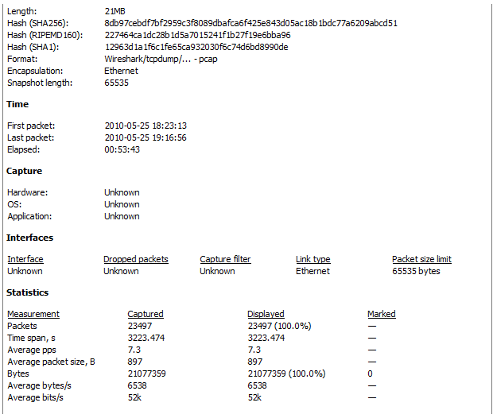
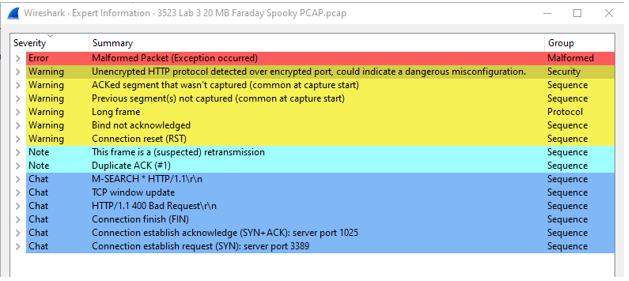
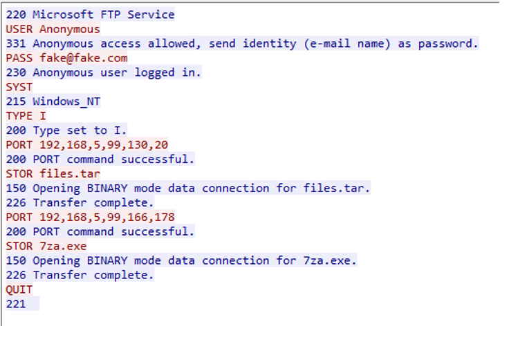
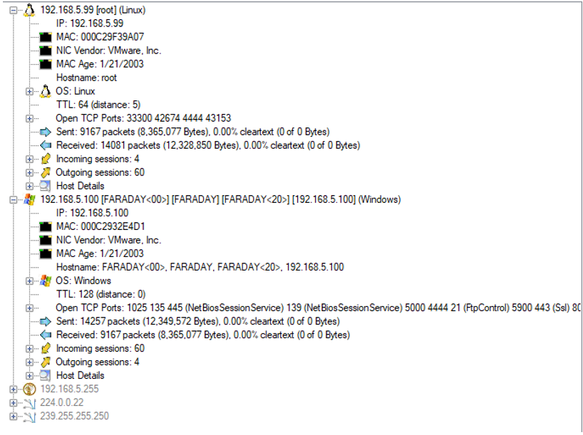
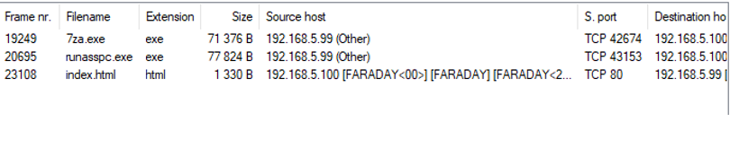
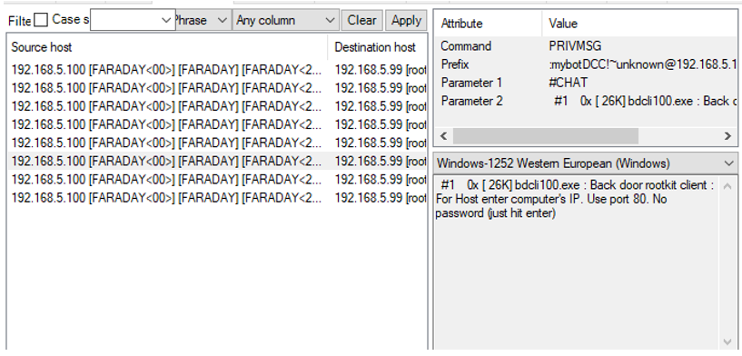
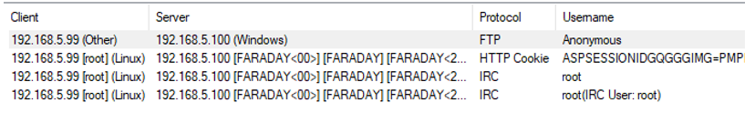
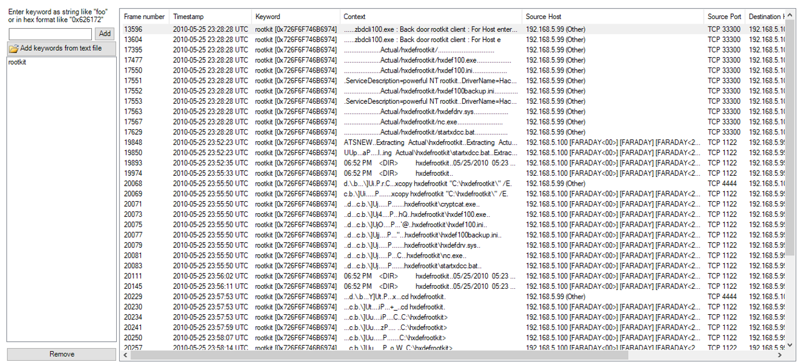
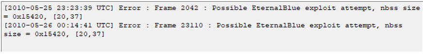

# Introduction

Despite the best efforts of software engineers and security practitioners, the risk of a cyber security attack can be minimized, but it is likely that it will never be zero. As such, it is essential that systems and network administrators along with IT specialists have a plan to respond to such an incident when (not “if!”) it occurs. In this lab, a scenario is proposed in which a facility has had one of their critical machines compromised with malware. It is my job, therefore, to assist the facility by applying the steps of incident response to investigate the breach, come up with a response plan, and recommend new security measures.

## Analyzing the Capture File with Wireshark

Based on my experience from the previous lab, I feel like I have found an effective way to accurately detect and diagnose cyber incidents. That is, using the packet sniffers Wireshark and NetworkMiner together and using their strengths to build a coherent profile of the attack. As the section title suggests, this section will be about the information I have gathered using Wireshark.

To begin, I download the PCAP file onto my computer and load it onto Wireshark. Then, I start simple and collect some basic statistics about the capture file. The information provided in Figure 1 is more comprehensive, but I will cover the important characteristics here. First, the capture date is logged as May 25, 2010, and has an elapsed time of 53 minutes and 43 seconds with a total length of 21 MB. There are, in total, 23497 packets captured with a vast majority of them being TCP packets. There are no losses to be reported, and at first glance, this seems like an ordinary capture file. However, a brief analysis of the capture file indicates a large amount of TCP RST packets. Also known as TCP Reset, these empty packets are sent “when an unexpected TCP packet arrives at a host” (PICO). Moreover, I have gathered from PICO Knowledgebase that there are three main reasons for a TCP reset packet to be sent. The first is that the packet “is an initial SYN packet trying to establish a connection to a server port on which no process is listening” (PICO). The second is that the packet “arrives on a TCP connection that was previously established, but the local application already closed its socket or exited and the OS closed the socket” (PICO). In summary, a TCP reset packet is essentially a TCP packet without a home. The third reason, however, raises suspicion. The Knowledgebase also suggests that another possible reason for occurrence is malicious behavior such as trying to hijack a TCP connection. For that reason, I will be doing an even deeper analysis of the capture file by using the “Expert Information” feature.

- <i>Figure 1</i>: Basic statistics for the PCAP file. The capture file’s date, time, and file size can be found here. Notice that, interestingly, properties about the network could not be identified.

  

There are quite a few notes that the Expert Information panel brings up. Once again, a more comprehensive list can be found in Figure 2, but I will be touching upon the important points here. First and foremost, the panel reports an error stating that there are malformed packets. In Wireshark’s words, a packet being malformed means that “the protocol dissector can’t (sic.) dissect the contents of the packet any further” (Wireshark). It is also sent with a non-existent placeholder RSL protocol to indicate that this packet is irregular and cannot be analyzed. This information will be extremely important later.

- <i>Figure 2</i>: The notes displayed in the “Expert Information” panel. Notice the malformed packet warning, the unencrypted HTTP protocol, and the TCP retransmission alert.

  

The next point the Expert Information panel brings up is an unencrypted HTTP protocol being detected. Though I could not find an exact source, perusal of multiple forum threads in Wireshark’s Q&A section indicates that this means HTTP traffic has been detected in port 433, which is for HTTPS traffic. In other words, insecure information is being transferred through what is supposed to be a secure port. This is indicative of a critical misconfiguration in network activity.

Finally, the last major error in the Expert Information panel warns that there are a few cases of TCP retransmission. This occurs “when the sender retransmits a packet after the expiration of the acknowledgement.” This means that the sender has sent another SYN packet even though the same sender has already concluded the connection with an ACK packet. Therefore, I believe that this can possibly suggest either session or connection hijacking.

The observation I made in Wireshark is perhaps the most interesting. In the capture file, there are quite a few FTP packets that can be found. Even without analyzing them, I have learned from the previous lab that finding FTP packets should immediately raise concern since average users no longer intentionally operate with FTP. Nevertheless, I still follow the TCP stream and the plaintext output is found.

- <i>Figure 3</i>: Analysis of this interaction brings up some major concerns. From what I have gathered, someone other than the host user has logged onto Microsoft’s FTP service anonymously and downloaded two extremely suspicious files onto the host computer. The files in question are named “files.tar” and “7za.exe”.

  

The program tar is “a Unix-based utility used to package files together for backup or distribution purposes” (FileInfo). However, I have found that TAR files are used for malicious purposes since they can package and distribute malware so well. This is helpful for hackers because “the malware is contained in a container file, (sic.) and can thus more easily evade detection” (Stevens, SANS ISC InfoSec Forums). Furthermore, 7za.exe “is an executable file of 7-zip and is mainly for the purpose of zipping multiple files in a bulk” (Comodo). This becomes dangerous when a hacker tampers and mimics the original file type. As the analysis in the NetworkMiner section will prove, this is an example of steganography as the intruder has disguised a malicious group of files as an ordinary 7za executable file. Though the file types are different, it is apparent that they both have the same objective of transferring a massive payload onto the host computer while avoiding detection. However, this is not entirely true as Wireshark indicates two instances of NBSS or NetBIOS Session Service protocols. This protocol “is a method to connect two computers for transmitting large messages or heavy data traffic” (Techopedia). Therefore, I conclude that these two instances of the packets are where the intruder downloaded the malicious files onto the host computer. Now, with the specifics of the capture file covered, I will now move on to NetworkMiner to analyze the bigger picture of the capture file and its implications.

## Analyzing the Capture File with NetworkMiner

As mentioned, NetworkMiner is more dedicated to analyzing capture files in a more general way that is easier to understand. As such, I find NetworkMiner to be useful in that in jumps straight to the point and tells me whether something is wrong in addition to having a more comprehensive view of the network structure. As noted in Figure 2, Wireshark failed to pick up any statistics about the network in the capture file. This is not the case for NetworkMiner as the “Hosts” tab shows a list of hosts that were detected in the network.

- <i>Figure 4</i>: there are two active hosts transferring data and three inactive hosts that are not. The first host is a Linux-based operating system with an IP address of 192.168.5.99. The second is a Windows-based operating system with an IP address of 192.168.5.100. The similarities of the IP addresses along with the vendor information leads me to believe that the Linux computer is virtual machine that is running on a Windows computer.

  

The next tab in NetworkMiner is labeled “Files.” In it, I can see any files that were transferred while the packet sniffer was capturing information.

- <i>Figure 5</i>: There were three files transferred with two of them coming from the virtual machine. As expected, the 7za.exe file is present and was downloaded from the virtual machine to the host computer. Also expected is the absence of the TAR file since the hacker chose it specifically because it can bypass detection.

  

There is no data in the “Images” tab, but there are some very suspicious interactions in the “Messages” tab. In it, I see that there was a user in the Linux machine that was chatting with a bot named “mybotDDC” in the IRC or Internet Relay Chat. This is distressing because looking at the output from the bot reveals that the user can use its commands to do some very nasty things including inserting a backdoor rootkit client (that is important!), cracking passwords, and providing a list of hashed passwords for a rainbow table attack.

- <i>Figure 6</i>: Some of the major messages from the bot found in the IRC. The selected message chillingly reveals that the bot can install a rootkit onto the victim's computer, and the attacker fully intends to do so.

  

The next tab, “Credentials”, is brief and provides some information that has already been discussed but is still nevertheless important. 

- <i>Figure</i>: The "Credentials" tab. In it, I can see that there is an additional client using FTP with the username “Anonymous”. This is in line with the TCP stream I uncovered in Wireshark as it proves that there is an unauthorized user on the network who has logged onto Microsoft’s FTP service anonymously.

  

The next significant tab is “Keywords” in which I can do a keyword search to find any relevant information. Up to this point, I have gathered evidence that the attacker is attempting to insert a rootkit into the host Windows computer. As such, I thought it reasonable to search through the exchanges with the keyword “rootkit.” Much to my surprise, there were quite a few entries that returned with that exact keyword.

- <i>Figure 8</i>: The results from searching for the keyword, "rootkit". There is a variety of packets containing things such as malicious .exe and .sys files in addition files that are outright described as being backdoors for the target computer.

  

Now, with this information in addition to the information gathered in the “Messages” tab, I can now draw two conclusions: The first is that the hacker has inserted a rootkit into the facility’s computer, and the second is that the hacker is likely a script kiddie since he is using a bot that is preconfigured to commit cyber attacks in addition to a rootkit that appears to be premade since it is comprehensively labeled, makes use of popular methods of transmission (TAR and 7za.exe), and is overall poorly disguised.

Finally, and perhaps most importantly, there is the “Anomalies” tab. In it, NetworkMiner cuts straight to the chase and tells me whether something is wrong.

- <i>Figure 9</i>: The warning message in the "Anomalies" tab. The message states that in frames 2042 and 23110, there are possible EternalBlue exploits. Coincidentally, these are also the frames in which the NBSS protocols are found.

  

Therefore, the intruder is using an EternalBlue exploit with Microsoft’s FTP service to download a rootkit from the Linux virtual machine onto the host’s Windows computer. Now, to be precise, I will discuss what, exactly, EternalBlue is and how it is exploited. Antivirus service Avast defines EternalBlue as “both the given name to a series of Microsoft vulnerabilities and the exploit created by the NSA as a cyberattack tool” (Avast). The exploit in question has to do with Microsoft’s FTP service and how it handles packets. First off, a major flaw on the company’s side is that it allows anonymous access to its FTP. With this in mind, the intruder logs on anonymously and sets it target as the host computer. Then, he takes his files, which are disguised innocently enough, and offers them for download onto the host computer. Whether the host user was aware or not, the host computer accepts, and the files are downloaded. This means, then, that all the attacker needs to do is send his specially crafted malicious packets and Windows will unintentionally propagate its payload. 

As a final statement, a rootkit was downloaded on May 25, 2010, at 18:23 (6:23 PM) from a Linux virtual machine to the Windows host computer. The incident is classified as an EternalBlue exploit and is extremely severe as it provides a backdoor for the intruder in addition to means for controlling the host’s computer without his knowledge. The incident is described as a compromise in network security as an intruder now has full access to one of the facility’s most important and secret computers.

## Eradication of the Threat

To eradicate this threat, I must first advise that the facility immediately quarantines the infected computer by severing its connection with the rest of the network and deactivating the virtual machine it is running. Then, before the facility’s network administrators can consider removal, they must first consider how to detect this threat. In this case, the facility was lucky that the hacker is likely an amateur since his attempts at installing a rootkit were extremely detectable. However, for the sake of being thorough, I believe that they should make a memory dump of the computer and compare its list of files to the list the computer currently displays. Any discrepancies in information can be identified as a rootkit file and can therefore be labeled as a file that needs to be purged.

Alternatively, I can also propose that the administrators use rootkit removal software from popular antivirus companies such as Kaspersky, Avast, or Norton. However, I recommend this only under the assumption that this rootkit is old and not maintained and as such, can be detected by modern virus scanners. In short, hinder the infected computer’s impact by removing it and the virtual machine from the network, and then address the rootkit with conventional and accepted means.

## System Recovery and Preventing Similar Incidents in the Future

After the infected computer has been quarantined and the administrators are sure that the rootkit has been removed, they should take the steps that we have covered in class regarding system recovery. That is, reformat all disks, restore the operating system, reload software, assign new passwords, scan for any newly created files, and check for changes that may affect security such as trapdoors, logic bombs, or, in this case, backdoors. Once all of this is done, the computer can then be re-integrated into the network.

Lucky for the facility, I have observed this incident to be common and easily preventable. My first recommendation is that the facility completely disables anonymous access to its FTP and requires thorough user authentication before any transferring of files can be done. As for the EternalBlue exploit, Avast has indicated that it occurs due to an exploit in Window’s SMBv1 software (Avast). In response, Microsoft released the MS17-010 patch “which was designed to fix this flaw for all Windows operating systems” (Avast). It is paramount, therefore, that the system administrators ensure that this patch is installed onto every computer in their network. In doing so, they will close these extremely popular avenues for attack.

# Conclusion

Like the previous lab, I greatly enjoyed investigating this incident and coming up with my conclusions. I also liked how I not only had to diagnose the situation, but also propose solutions for it. As such, I feel like this was very good practice for incident response and provided great insight as to how a person on an incident response team would react to a real-life situation.

# References

- <a href="https://fileinfo.com/extension/tar" target="_blank">.TAR File Extension - What Is a .tar File and How Do I Open It?</a>

- <a href="https://www.wireshark.org/docs/wsug_html_chunked/AppMessages.html#:~:text=Malformed%20packet%20means%20that%20the,known%20TCP%20or%20UDP%20port" target="_blank">Appendix A. Wireshark Messages</a>

- <a href="https://www.avast.com/c-eternalblue#topic-4" target="_blank">What Is EternalBlue and Why Is the MS17-010 Exploit Still Relevant? - Carly Burdova</a>

- <a href="https://file-intelligence.comodo.com/windows-process-virus-malware/7za?af=7450" target="_blank">Comodo - Malware Search Engine</a>

- <a href="https://wiki.wireshark.org/TCP_Analyze_Sequence_Numbers" target="_blank">TCP_Analyze_Sequence_Numbers - The Wireshark Wiki</a>

- <a href="https://www.techopedia.com/definition/25190/netbios-session-service-nbss" target="_blank">What Is NetBIOS Session Service (NBSS)? - Techopedia</a>

- <a href="https://www.pico.net/kb/what-is-a-tcp-reset-rst/" target="_blank">What Is a TCP Reset (RST)? - Pico</a>
